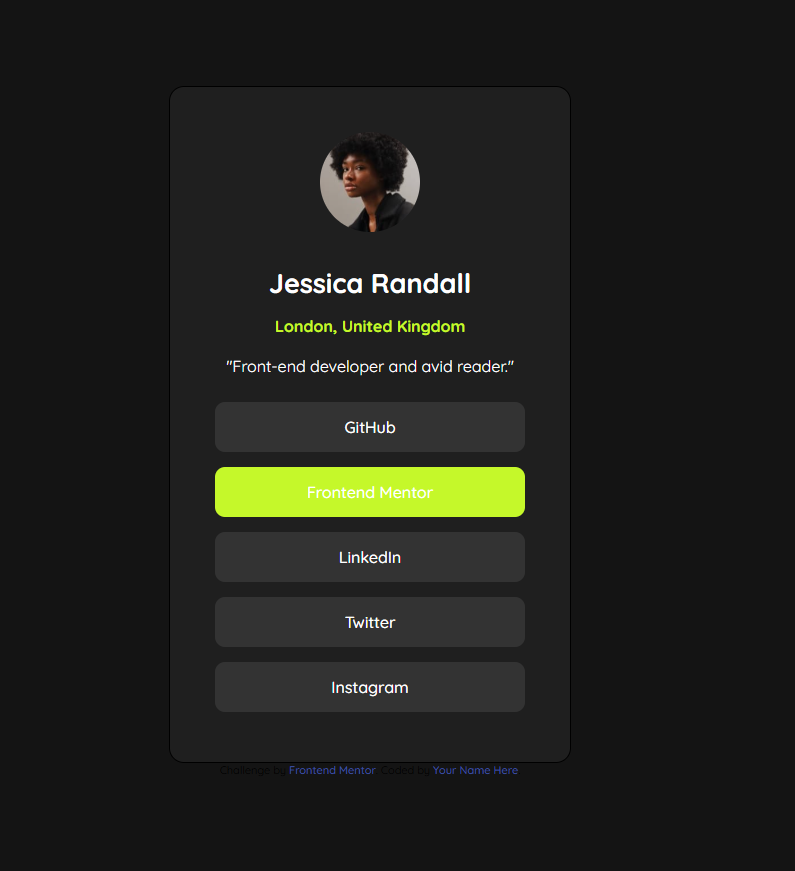

# Frontend Mentor - Social links profile solution

This is a solution to the [Social links profile challenge on Frontend Mentor](https://www.frontendmentor.io/challenges/social-links-profile-UG32l9m6dQ). Frontend Mentor challenges help you improve your coding skills by building realistic projects. 

## Table of contents

- [Overview](#overview)
  - [The challenge](#the-challenge)
  - [Screenshot](#screenshot)
  - [Links](#links)
  - [Built with](#built-with)
  - [What I learned](#what-i-learned)
  - [Continued development](#continued-development)
- [Author](#author)

## Overview

### The challenge

Users should be able to:

- See hover and focus states for all interactive elements on the page. Please note these links do not anchor anywhere , a separate project with my own personal links is on the way !

### Screenshot

### Links

- Solution URL: [Solution](https://github.com/kagiso101/social-links-profile-main)
- Live Site URL: [Live site URL](https://kagiso101.github.io/social-links-profile-main/)

## My process

### Built with

- Semantic HTML5 markup
- CSS custom properties
- Flexbox
- Mobile-first workflow

### What I learned

This was my second attempt at this project , I originally finished the first one using my own info and an Api that generates random advice just to spice things up a bit, But Im still figuring out a way to host angular applications on a free platform like github /netlify. These are projects I do to help my students gain a better understanding of how the frontend works so there's a limit to what I can learn using plain html and css, although I must say it was fun doing this project . (took me an hour to finish and then an additional 30min for this readme )

### Continued development

For furture projects , I'll be using angular 18 as soon as I learn how to deploy them

## Author

- Frontend Mentor - [@kagiso101](https://www.frontendmentor.io/profile/kagiso101)
